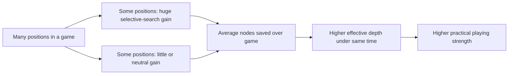
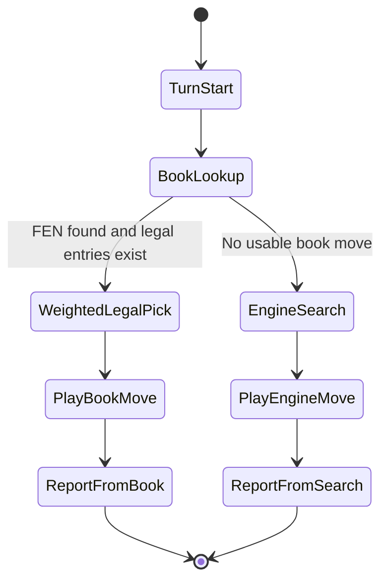

# Computer Chess

This document explains how OM Scacchi represents positions, how its engine works, and why the current representation is a good fit for ECMAScript.

Runtime note:

- The default gameplay AI path is negamax-based (`js/chess/ai/negamax_search.js`).
- Legacy UCT code exists in `js/uct/` and is tested, but is not currently used by `js/controller.js`.

## 1. Board Representation in OM Scacchi

OM Scacchi currently uses a position object built around an explicit 8x8 board array.

Conceptually, a position contains:

- board: 8 ranks x 8 files, each square is either null or a one-character piece symbol
- sideToMove: "w" or "b"
- castling: normalized rights string like "KQkq" or "-"
- enPassant: "-" or target square like e3/e6
- halfmoveClock: non-negative integer
- fullmoveNumber: positive integer
- optional search metadata such as zobristKey and repetitionKeys

Piece encoding:

- Uppercase = White (P N B R Q K)
- Lowercase = Black (p n b r q k)

Square indexing in code:

- row 0 is rank 8
- row 7 is rank 1
- col 0 is file a
- col 7 is file h

So e2 is row 6, col 4.

Why this is practical here:

- Move generation and rule logic are very readable and easy to debug.
- FEN parse and serialize are straightforward and strongly validated.
- The code avoids brittle bit-twiddling and remains maintainable.

Position data-flow overview:

Position (board + state fields)
    -> Move generator builds pseudo-legal and legal moves
    -> Rules apply a move to produce next immutable snapshot
    -> Search evaluates and recurses over snapshots

## 2. Why Bitboards Are Less Useful in ECMAScript

Bitboards are excellent in C/C++/Rust engines, but in JavaScript they are often less beneficial than expected unless carefully engineered.

Main reasons:

- JavaScript bitwise operators are 32-bit for Number.

    - Classical bitboard operations assume 64-bit integers.
    - Number-based bitwise math truncates to 32 bits, so you must split high/low words or use BigInt.

- BigInt is correct but typically slower in tight search loops.

    - BigInt avoids 32-bit truncation, but arithmetic and masking in deep node counts can become expensive.
    - Engine hot paths (move gen, attack maps, SEE-like routines) are very sensitive to this overhead.

- JIT predictability and de-optimizations.

    - Mixed Number/BigInt paths can trigger de-opts.
    - Stable monomorphic object/array access often performs more consistently in JS engines.

- Interop and memory model complexity.

    - A pure bitboard stack usually pushes you toward packed typed arrays and precomputed masks everywhere.
    - That can be fast, but it raises implementation complexity significantly versus the current array board.

- Diminishing returns at this project scale.

    - OM Scacchi gains more strength from search heuristics and evaluation quality than from switching representation alone.

Bottom line:

- In OM Scacchi, the current board model is a strong engineering trade-off: simpler correctness, easier maintenance, and enough speed when combined with modern search heuristics.

## 3. Engine Techniques in OM Scacchi (Ranked by Relevance)

Relevance here means practical influence on playing strength in this codebase.

### 3.0 Evaluation Quality (Critical)

What it does:

- Assesses position strength beyond material: pawn structure, king safety, and piece coordination.
- Uses tapered evaluation (separate middlegame and endgame terms for king placement).
- Includes pawn-structure terms: isolated/doubled pawn penalties and connected passed-pawn bonuses.

Strength impact:

- Directly reduces blunders from weak positional judgment.
- Prevents the engine from creating permanently damaged pawn structures without compensation.
- Recognizes passed pawns and pawn chains as critical endgame assets.

Historical issue addressed:

- Without pawn-structure terms, the engine could create isolated or doubled pawns for short-term activity.
- With connected-passed-pawn detection, endgames with two advanced pawns are recognized as near-winning.

### 3.1 Negamax with Alpha-Beta Pruning (Very High)

What it does:

- Searches move trees assuming optimal play from both sides.
- Uses alpha-beta bounds to prune branches that cannot improve the result.

Strength impact:

- Core strength driver.
- Enables deeper tactical search for the same time budget.

### 3.2 Iterative Deepening + Time Budgets (Very High)

What it does:

- Searches depth 1, then 2, then 3, etc., until soft/hard time or node limits.
- Always keeps the best completed result so far.

Strength impact:

- Improves move quality under real-time constraints.
- Produces stable play and avoids catastrophic time overruns.

Search control state chart:

Start move
    -> depth = 1
    -> search depth
    -> if soft-time/node limit hit: stop with last complete depth
    -> else depth++ and repeat
    -> return best PV move

### 3.3 Transposition Table (Very High)

What it does:

- Caches previously searched positions (EXACT, LOWER, UPPER bounds).
- Reuses results across move orders and across turns (persistent table in worker).
- Current keying is based on serialized FEN + side to move.

Strength impact:

- Major effective depth increase in middlegames with transpositions.
- Also helps move ordering via stored best move.

### 3.4 Move Ordering Heuristics (Very High)

What it does:

- Orders moves so strong candidates are searched earlier.
- Uses TT move, tactical ordering, killers, history, counter-move heuristic.

Strength impact:

- Alpha-beta pruning effectiveness depends heavily on ordering.
- Better ordering can save huge node counts and improve tactical sharpness.

### 3.5 Principal Variation Search, LMR, Null-Move, Check Extensions (High)

What they do:

- PVS: zero-window probing on non-first moves, re-search only when needed.
- LMR: reduces depth on late quiet moves; restores depth if needed.
- Null-move pruning: tries a skip move to detect easy fail-high cutoffs.
- Check extensions: extends depth in forcing check lines.

Strength impact:

- Large practical speed-strength gain when tuned safely.
- Better tactical reach in forcing lines and better selectivity elsewhere.

Selective search flow:

Node
    -> try TT bounds
    -> maybe null-move probe
    -> generate ordered moves
    -> for each move:
         -> maybe extend (check)
         -> maybe reduce (LMR)
         -> PVS/alpha-beta recurse
         -> cutoff updates killer/history/counter-move

### 3.6 Quiescence Search (High)

What it does:

- At depth horizon, continues searching tactical moves (captures/promotions/checks) to avoid horizon artifacts.

Strength impact:

- Dramatically reduces blunders like hanging pieces just beyond nominal depth.

### 3.7 Tactical Pattern Recognition (High)

What it does:

- Pin detection: identifies pieces pinned to the king and reduces their effective value.
- Back-rank weakness: penalizes undefended back-rank setups when enemy major pieces can exploit them.
- Attack coordination: rewards positions where attackers outnumber defenders near the enemy king.

Strength impact:

- Reduces tactical blunders in forcing positions.
- Improves king-safety judgment beyond immediate check detection.
- Prevents hanging pinned pieces and casual back-rank losses.

Historical issues addressed:

- Pinned-piece blunders: moving a pinned bishop/queen and losing material immediately.
- Back-rank oversights: allowing mate threats with no luft and weak back-rank defense.
- Coordination blindness: underestimating multi-piece king attacks.

### 3.8 Evaluation Function: Full Term Summary (Medium to High)

All evaluation terms integrated into `evaluatePosition()`:

- material
- piece-square tables
- tapered king placement (middlegame/endgame)
- bishop pair
- rook file activity
- passed pawns
- king shield
- isolated/doubled pawn penalties
- connected passed-pawn bonuses
- pin detection penalty
- back-rank weakness penalty
- attack coordination bonus
- mobility
- check pressure

Strength impact:

- Positional terms prevent strategic blunders in quiet positions.
- Tactical terms prevent forcing-line blunders in sharp positions.

### 3.9 Aspiration Windows (Medium)

What it does:

- Starts deeper search around prior score with a narrow window.
- Falls back to full window on fail-low/fail-high.

Strength impact:

- Can reduce search time, allowing more depth within the same time.
- Usually a secondary gain compared with move ordering and TT.

### 3.10 Quiescence Pruning (Medium)

What it does:

- In quiescence, evaluate captures with SEE (Static Exchange Evaluation).
- Prune clearly losing captures (SEE < -200) that don't lead to further tactics.
- Reduces horizon effect by avoiding futile capture chains.

Strength impact:

- Prevents wasteful spending of search budget on moves that lose material.
- Lets the search focus on truly forcing moves (winning captures, checks).
- **Reduces tactical blunders** where the engine chases small material gains into bad positions.

Historical issue addressed:

- Without capture pruning, quiescence could spin into long sequences of mutual captures that all lose material.
- With SEE thresholds, only moves that win material (or give check) are explored deeply.

### 3.11 Repetition-Avoidance Policy (Medium to High)

What it does:

- Detects when the current best move would immediately end in threefold repetition.
- If the engine is already clearly better, it probes non-repetition alternatives with a reduced verification search.
- Accepts an alternative only when the expected score drop stays within a bounded margin.

Strength impact:

- Converts more winning positions instead of settling for unnecessary draws.
- Reduces repetitive checking loops when a practical winning plan exists.
- Preserves safety by refusing speculative alternatives that are much worse.

Historical issue addressed:

- The engine could choose a repetition line even in positions with clear winning continuations.
- This produced avoidable threefold draws and made AI play look passive in better endgames/middlegames.

## 4. Opening Book: How It Works and Why It Matters

OM Scacchi opening book is implemented as a map:

- Key: full FEN string of current position
- Value: weighted list of candidate UCI moves

Selection logic:

1. Read candidates for current FEN.
2. Keep only moves that are legal in the current position.
3. Randomly sample by weight.
4. If a book move exists, play it directly (no search).
5. If no book move exists, run negamax search.

Book/engine decision flow:

Turn starts
    -> lookup FEN in book
    -> legal weighted candidate exists?
         -> yes: weighted random pick, play instantly
         -> no: run search engine

Influence on playing strength:

- Immediate opening quality: avoids weak early move choices.
- Better middlegame entry: reaches known healthy structures more often.
- Time saving: preserves compute budget for non-book positions.
- Variety: weighted randomness avoids predictable, repetitive openings.

Limitations:

- Coverage-dependent: outside mapped FENs, strength falls back entirely to search.
- Quality-dependent: poor book lines can hurt strength quickly.

## 5. Practical Summary

In OM Scacchi, strength comes primarily from search quality and pruning efficiency, then evaluation quality, then opening-book coverage. The current array-based board model is a good ECMAScript fit because it supports correctness and maintainability while still enabling a strong modern negamax engine with practical heuristics.

## 6. Concrete Position Examples (Measured)

The following measurements were taken from the current engine with different feature toggles.

### 6.1 Position A: Open Game Middlegame

FEN:

- r1bqkbnr/pppp1ppp/2n5/4p3/2B1P3/5N2/PPPP1PPP/RNBQK2R b KQkq - 2 3

Results:

- Full engine: move f8c5, score 39, nodes 5581, depth 5
- Null-move/LMR/check-extension disabled: move g8h6, score 0, nodes 119554, depth 5

Interpretation:

- On this position, selective search and pruning reduce node count by about 21x.
- The best move choice also changes, indicating that strength gain is not only speed, but often quality.

### 6.2 Position B: Tactical Capture Case

FEN:

- k7/8/8/2q1p3/3P4/8/8/7K w - - 0 1

Results:

- Full engine: move d4c5, score -65, nodes 2896, depth 4
- Null-move/LMR/check-extension disabled: move d4c5, score -65, nodes 1013, depth 4

Interpretation:

- The tactical best move is robust regardless of selective features.
- This is expected: selective heuristics are not uniformly better on every position.
- Their net benefit appears across many positions and time controls, not every single test case.

### 6.3 Why the aggregate gain still matters



## 7. Opening Book Influence Example

For opening-book positions, the controller path is:



Practical strength effect in OM Scacchi:

- Book moves are played instantly with nodes = 0 on those turns.
- Saved compute budget is spent later in non-book middlegame positions.
- Weighted choices improve opening variety while still preferring stronger mainstream lines.

## 8. Reproducible Benchmark Appendix

These benchmarks exercise the negamax engine implementation.

Preferred command from the project src directory:

```powershell
$env:PATH = "C:\Program Files\nodejs;" + $env:PATH
npm run benchmark:engine
```

Equivalent direct invocation (without npm script):

```powershell
$env:PATH = "C:\Program Files\nodejs;" + $env:PATH
node --input-type=module -e "import { parseFen } from './js/chess/fen.js'; import { searchBestMove } from './js/chess/ai/negamax_search.js'; const cases=[{name:'Open game',fen:'r1bqkbnr/pppp1ppp/2n5/4p3/2B1P3/5N2/PPPP1PPP/RNBQK2R b KQkq - 2 3',opts:{depth:5,maxNodes:900000,iterativeDeepening:true,maxTimeMs:0}},{name:'Tactical capture',fen:'k7/8/8/2q1p3/3P4/8/8/7K w - - 0 1',opts:{depth:4,maxNodes:400000,iterativeDeepening:true,maxTimeMs:0}}]; const variants=[{label:'Full engine',extra:{}},{label:'No null/LMR/check-ext',extra:{useNullMovePruning:false,useLmr:false,checkExtensions:false}},{label:'No PVS/aspiration',extra:{usePvs:false,aspirationWindows:false}}]; for (const c of cases){ const p=parseFen(c.fen); console.log('---',c.name,'---'); for (const v of variants){ const r=searchBestMove(p,{...c.opts,...v.extra}); console.log(v.label, JSON.stringify({move:r.moveUci,score:r.score,nodes:r.nodes,depth:r.searchedDepth,pv:r.pv.slice(0,5)})); }}"
```

Expected output structure:

- One block per position: --- Position Name ---
- One line per variant containing JSON with:
    - move
    - score
    - nodes
    - depth
    - pv (first 5 moves)

How to use it in reviews:

1. Run once before a change and save output.
2. Run again after the change with the same command.
3. Compare nodes, depth, and best move stability.
4. Treat large score spikes (especially extreme values) as a signal to inspect search-window behavior.
