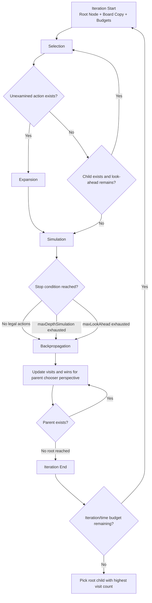
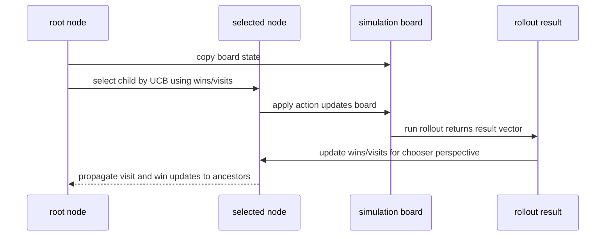

# UCT / MCTS Engine - om_scacchi (Legacy Module)

This document describes the legacy UCT/MCTS engine module that is still present in the repository:

- `js/uct/uct.js`
- `js/uct/uctnode.js`

Status note:

- `js/controller.js` currently uses `js/chess/ai/negamax_search.js` as the active runtime chess AI.
- The UCT module is retained for legacy coverage and experimentation (`tests/unit/uct.test.js`).

It reflects the current implementation of the UCT module itself.

For broader system structure and module interactions, see [software_architecture.md](software_architecture.md).

---

## 1. Engine Entry Point

The AI search entry point is:

```js
Uct.getActionInfo(board, maxIterations, maxTime, maxDepthSimulation, maxLookAhead)
```

Input contract:

- `board`: mutable adapter implementing
  - `getActions()`
  - `doAction(action)`
  - `copy()`
  - `getResult()`
  - `active`

Return value:

```js
{ action: number | null, info: string }
```

Behavior:

- no legal moves -> `action: null`
- one legal move -> immediate return that move
- otherwise run UCT search and return the root child with the highest visit count

---

## 2. Four UCT Phases in This Codebase



Compact data-dependency view for debugging:



### Selection

From root, repeatedly select child with maximum UCB score until reaching a node
that still has unexamined actions, or has no children, or look-ahead budget is exhausted.

### Expansion

If current node has unexamined actions, select one random unexamined action,
apply it to the simulation board, and create one new child.

### Simulation

Play random legal actions from the expanded state until one of these happens:

- no legal actions
- `maxDepthSimulation` exhausted
- `maxLookAhead` exhausted

### Backpropagation

Propagate final simulation result from leaf to root, updating visits and wins.

Important implementation detail:

- Reward is accumulated from the perspective of the chooser at each edge
  (parent player perspective), so UCB remains coherent across alternating turns.

---

## 3. UCB Formula Used

Selection in `UctNode.selectChild()` uses:

$$
UCB = \frac{wins}{visits} + \sqrt{\frac{2\ln(parentVisits)}{childVisits}}
$$

where:

- exploitation: $wins / visits$
- exploration bonus: $\sqrt{2\ln(N)/n}$

Notes:

- Exploration constant is effectively fixed at $\sqrt{2}$ (hardcoded form above).
- This implementation does not currently expose exploration constant as a runtime parameter.

---

## 4. Parameter Deep Dive

The `Uct.getActionInfo(...)` parameters control breadth, depth, and responsiveness.

### `maxIterations`

`maxIterations` is the maximum number of search loops the AI is allowed to run.
You can think of it as the AI's upper limit for how many ideas it may test.
When this value is higher, the AI usually plays better because it has tested
more possibilities. When this value is lower, the AI reacts faster but can miss
strong moves because it had less time to explore.

In practice, this value is a hard ceiling, not a promise. The search can still
stop earlier if the time budget (`maxTime`) is reached first.

### `maxTime` (ms)

`maxTime` is the wall-clock time limit in milliseconds. This is the main control
for how long the user waits before the AI moves.

On slower devices, this is usually the most important limit because time runs out
before iteration limits do. In this implementation, time is checked in batches,
so the AI can stop slightly after the exact target value.

### `maxDepthSimulation`

`maxDepthSimulation` controls how many random future moves are played during the
simulation phase of one rollout. This value affects how far each sampled line can
look into the future.

With a larger value, each rollout can capture richer tactical outcomes, but each
rollout also becomes more expensive. With a smaller value, the AI can run more
rollouts in the same time, but each one is shorter and noisier.

### `maxLookAhead`

`maxLookAhead` is a second depth limit that applies to the total path length of
one iteration, including both tree selection steps and simulation steps.

This parameter acts as a safety guard against very long single iterations.
If it is set too low, the search can cut off tactical lines too early, even when
`maxDepthSimulation` is high.

In short, `maxDepthSimulation` limits rollout depth, while `maxLookAhead` limits
overall per-iteration depth.

---

## 5. Parameter Interaction (Why Differences Matter)

These four values work together, so you should tune them as a group.
If you change only one value without considering the others, the result can be
surprising.

`maxTime` defines how much real time the AI may spend on one move. You can think
of it as the total search budget from the player's point of view.

`maxDepthSimulation` and `maxLookAhead` define how expensive each iteration is.
When these depth limits are higher, each rollout can see farther, but each rollout
also costs more. That means fewer total iterations can fit inside the same time budget.

`maxIterations` is the final ceiling. It only matters if the AI can actually reach
that many iterations before `maxTime` runs out.

In other words, you are balancing two goals: stronger tactical reading and faster
response time. Increasing all limits at once is not automatically better, because
you may get long waits with only small practical strength gains. The best values
depend on the target device profile and the user experience you want.

---

## 6. Runtime Wiring Clarification

The UCT parameter tuple remains:

```text
[maxIterations, maxTime, maxDepthSimulation, maxLookAhead]
```

However, those budgets are not currently wired into the default runtime chess worker path.
Current worker difficulty handling maps to negamax depth/node/time options.

---

## 7. Validation and Regression Coverage

Current tests in `tests/unit/uct.test.js` validate:

- legal action behavior and edge cases
- immediate winning move preference
- forced blocking move selection
- deterministic two-ply trap selection (both player perspectives)

This gives confidence that the retained UCT code remains functionally correct for legacy usage.

## 8. When To Use This Engine

- Use when running UCT-specific tests or experiments.
- Do not treat this module as the default gameplay AI in the browser app.

---

## 9. Future Improvement Options

1. Expose exploration constant as a configurable parameter.
2. Add lightweight rollout bias (center-column weighting) for better early-game quality.
3. Add transposition table keyed by board hash to reduce repeated work.
4. Add adaptive budget policy based on move number and remaining legal actions.
