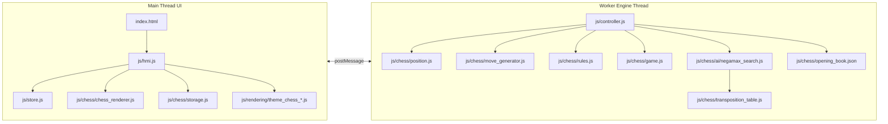
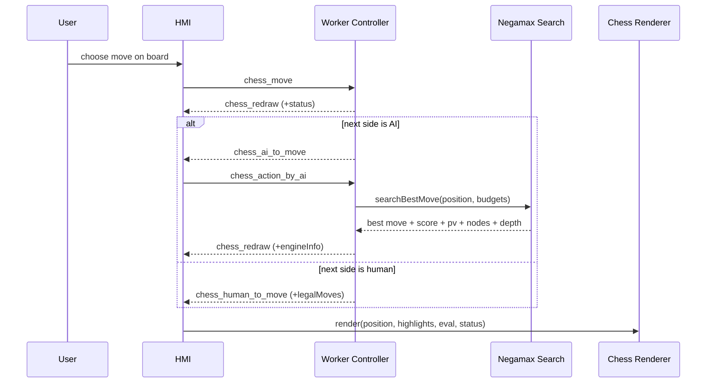

# Software Architecture - OM Scacchi (Current)

> Copyright (c) 2016, 2026 Oliver Merkel. MIT License.

## 1. Scope

This document describes the architecture currently implemented in `src/`.
The app is a browser chess PWA with a worker-owned game engine, main-thread UI, and a negamax-based AI.

## 2. Architecture Overview



## 3. Core Principles

- Worker is authoritative for chess position and status transitions.
- UI never applies moves directly; it only sends requests and renders updates.
- Chess core modules are pure-functional where possible (`position`, `move_generator`, `rules`, `game`).
- Persistence is isolated to browser storage helpers (`js/chess/storage.js`).
- Rendering concerns are isolated from move legality/search concerns.

## 4. Functional Blocks

### 4.1 UI and Navigation

- Main views: `game`, `rules`, `options`, `about`.
- Side panel commands include new game and undo.
- Cards rendered in game view:
  - board,
  - FEN input/apply,
  - engine telemetry,
  - move history.

### 4.2 Chess Position and Rules

Core modules:

- `js/chess/position.js`
- `js/chess/fen.js`
- `js/chess/move_generator.js`
- `js/chess/rules.js`
- `js/chess/game.js`

Implemented rule coverage:

- legal moves for all pieces,
- castling and en-passant,
- promotions,
- check/checkmate/stalemate,
- fifty-move rule,
- threefold repetition,
- insufficient material.

### 4.3 AI Layer

Primary engine:

- `js/chess/ai/negamax_search.js`

Supporting pieces:

- `js/chess/ai/move_ordering.js`
- `js/chess/transposition_table.js`
- `js/chess/opening_book.json`

Current search techniques:

- alpha-beta negamax,
- quiescence search,
- iterative deepening,
- aspiration windows,
- principal variation search,
- null-move pruning,
- late move reductions,
- check extensions,
- killer/history/counter-move ordering,
- persistent TT in worker scope.

Legacy/experimental engine modules under `js/uct/` still exist and are unit-tested, but are not on the runtime path in `controller.js`.

### 4.4 Rendering

- `js/chess/chess_renderer.js` renders board SVG, legal move overlays, last-move highlight, game result text, and an evaluation-based side bar.
- Theme adapters:
  - `js/rendering/theme_chess_glyph.js`
  - `js/rendering/theme_chess_svg.js`

## 5. Worker Message Protocol (Current)

See also: `doc/engine_protocol.md` for the field-level protocol reference.

Requests sent from UI to worker:

- `chess_start` (`fen` optional)
- `chess_move` (`action` move object)
- `chess_action_by_ai`
- `chess_undo`

Events emitted from worker to UI:

- `chess_redraw`
- `chess_human_to_move`
- `chess_ai_to_move`

Event payload fields in active use include:

- `chessPosition`
- `fen`
- `status`
- `legalMoves`
- `latestMoveUci`
- `engineInfo`

## 6. Runtime Interaction



## 7. Data Contracts

Position shape (logical):

```js
{
  board: (string | null)[][],
  sideToMove: "w" | "b",
  castling: string,
  enPassant: "-" | string,
  halfmoveClock: number,
  fullmoveNumber: number,
  repetitionKeys: string[]
}
```

Telemetry shape (from worker `engineInfo`):

```js
{
  pv: string[],
  nodes: number,
  score: number,
  depth: number,
  bestMove: string | null,
  fromBook: boolean,
  openingName: string | null
}
```

## 8. Testing and Quality Gates

- Unit tests: chess rules, FEN, SAN, search features, TT, move ordering, tactical benchmark, and UCT module.
- E2E tests: navigation, options, board interaction, new game reset, accessibility smoke.
- Coverage thresholds (Vitest): 98% statements, branches, functions, and lines.

## 9. Known Gaps

- No UCI-like command interface module is currently implemented.
- `engine_mcts_ucb.md` documents the legacy UCT module, not the default runtime chess AI path.
- No dedicated CI/process document exists outside contributor-facing notes; `doc/contributor_checks.md` is the current lightweight checklist.

## 10. Related Docs

- Opening book creation/refinement best practices: `doc/opening_book_best_practices.md`
